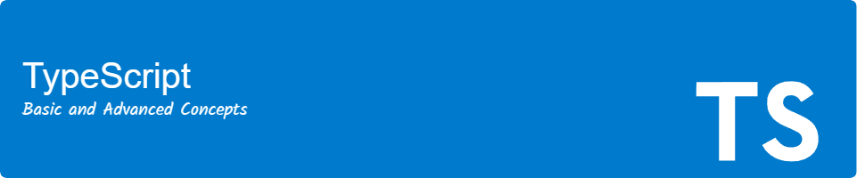

# 

Welcome to the **Complete TypeScript Guide**.

This repository contains a collection of exercises to practice and understand both basic and advanced TypeScript concepts. It aims to provide a hands-on approach to learning TypeScript through practical examples. Topics covered include data types, functions, objects, classes, interfaces, namespaces, generics, and decorators. Each section includes practical examples to aid in comprehension and proficiency in TypeScript.

Additionally, this project demonstrates practical applications by integrating with external APIs, such as the Marvel API.

## Table of Contents

1. [Requirements](#requirements)
2. [Technology Stack](#technology-stack)
3. [Project Structure](#project-structure)
4. [Installation](#installation)
5. [Usage](#usage)
6. [Use Marvel API](#use-marvel-api)
7. [Contributing](#contributing)
8. [License](#license)
9. [Author](#author)
10. [Acknowledgements](#acknowledgements)

## Requirements

You need to have the following installed:

A source code editor such as [VSCode](https://code.visualstudio.com/), [Sublime Text](https://www.sublimetext.com/), or any other editor of your choice.

[](https://nodejs.org/en)
[](https://www.npmjs.com/)

> [!NOTE]
> Clicking on the Node.js badge will take you to the Node.js website, where you can download the installer. It is recommended to use the stable version. When you install Node.js, npm will be installed automatically.

Check your Node.js and npm installation by running:

```bash
node --version
npm --version
```

## Technology Stack

<div>
  
  
  
  
</div>

## Project Structure

The project follows a structured directory layout:

```bash
├───📁 src/
│   ├───📁 api/
│   ├───📁 assets/
│   │   ├───📁 css/
│   │   ├───📁 icons/
│   │   └───📁 images/
│   ├───📁 data/
│   ├───📁 examples/
│   │   ├───📁 classes/
│   │   ├───📁 data-types/
│   │   ├───📁 decorators/
│   │   ├───📁 functions/
│   │   ├───📁 generics/
│   │   ├───📁 introduction/
│   │   ├───📁 namespaces/
│   │   ├───📁 objects/
│   │   └───📁 types/
│   ├───📁 interfaces/
│   ├───📁 utils/
│   ├───📄 main.ts
│   └───📄 vite-env.d.ts
├───📄 .env.template
├───📄 index.html
├───📄 LICENSE
├───📄 package-lock.json
├───📄 package.json
├───📄 README.md
└───📄 tsconfig.json
```

## Installation

To get started with the project, follow these steps:

1. **Clone the repository:**

```bash
git clone https://github.com/daniel-pompa/complete-typescript-guide.git
```

2. **Navigate to the project directory:**

```bash
cd complete-typescript-guide
```

3. **Install dependencies:**

```bash
npm install
```

4. **Run the development server:**

```bash
npm run dev
```

The server will typically run on <http://localhost:5173>, but check the output on your terminal to be sure.

## Usage

The main TypeScript file `main.ts` imports CSS, images, and example functions. Here's an overview of how it works:

```ts
import './assets/css/style.css'
import typescriptLogo from './assets/images/typescript.svg'
import gitHubLogo from './assets/icons/github.svg'
import linkeInLogo from './assets/icons/linkedin.svg'
import { insertCurrentYear } from './utils';
import { createHelloWorld, TITLE } from './examples/introduction/hello-world';

document.querySelector<HTMLDivElement>('#app')!.innerHTML = `
  <main>
    <header>
      <h1>Complete TypeScript Guide</h1>
    </header>
    <section>
      <h2>${TITLE}</h2>
      <div class="container">
        
        <p>Contact me via the following channels</p>
        <div class="social-media-container">
          <a
            href="https://github.com/daniel-pompa"
            target="_blank"
            rel="noopener noreferrer"
          >
            
          </a>
          <a
            href="https://www.linkedin.com/in/daniel-pompa"
            target="_blank"
            rel="noopener noreferrer"
          >
            
          </a>
        </div>
        <p>&copy; <span id="year"></span> Daniel Pompa Pareja</p>
      </div>
    </section>
  </main>
`;

insertCurrentYear('year');

// Add the example you want to use here
createHelloWorld();
```

### Use Marvel API

1. Create an account on the official [Marvel](https://developer.marvel.com/) website for developers.

2. Get an API Key.

Enter the Marvel API web site, log in and see the `How-Tos`. Marvel gives you an API-KEY and some codes to be able to consume its API, a public key and a private key to be able to make the request through the http protocol.

3. The following additional parameters are required to access the endpoints:

- ts: timestamp

- hash: a md5 digest of the ts parameter, your private key and your public key `md5(ts+privateKey+publicKey)`

You can generate the hash in the following link [MD5 Hash Generator](https://www.md5hashgenerator.com/)

4. Create a `.env` file in the root of your project:

```.env
VITE_MARVEL_API_KEY='YOUR API KEY HERE'
VITE_HASH='HASH GENERATED WITH TIMESTAMP+PRIVATE KEY+PUBLIC KEY'
VITE_TS='TIMESTAMP'
```

Below is an example of how to make a request:

```ts
import axios from 'axios';
import { IMarvelHero } from '../interfaces';

/**
 * A function to get a marvel hero by its name from the Marvel API
 * @param {string} name - The name of the hero to get
 * @returns {Promise<IMarvelHero>} - A promise that returns the hero data
 */
export const getMarvelHero = async (name: string): Promise<IMarvelHero> => {
  const baseUrl = 'https://gateway.marvel.com';
  const endpoint = 'v1/public/characters';
  const apikey = import.meta.env.VITE_MARVEL_API_KEY;
  const hash = import.meta.env.VITE_HASH;
  const ts = import.meta.env.VITE_TS;
  const { data } = await axios.get<IMarvelHero>(
    `${baseUrl}/${endpoint}?apikey=${apikey}&hash=${hash}&ts=${ts}&name=${name}`
  );
  return data;
};
```

> [!NOTE]
> The following link [Interactive API Tester](https://developer.marvel.com/docs) displays documentation of all endpoints, parameters and error messages available for the Marvel API.

## Contributing

Contributions are welcome! Please follow these steps:

1. Fork the repository.
2. Create a new branch (`git checkout -b feature-branch`).
3. Make your changes.
4. Commit your changes (`git commit -am 'add new feature'`).
5. Push to the branch (`git push origin feature-branch`).
6. Create a new Pull Request.

## License

[](https://choosealicense.com/licenses/mit/)

## Author

This project is maintained and developed by **Daniel Pompa Pareja**.

<div>
  <a href="https://www.linkedin.com/in/daniel-pompa" target="_blank" rel="noopener noreferrer">
    
  </a>
  <a href="mailto:daniel.40.pompa@gmail.com">
    
  </a>
</div>

If you have any questions, suggestions, or feedback, please feel free to reach out to me.

## Acknowledgements

Special thanks to the creators of the [GitHub Profile Header Generator](https://leviarista.github.io/github-profile-header-generator/), which I used to generate the header image for this README.

I would like to extend my sincere thanks to the following individuals and organizations for their contributions and support:

- **[Vite](https://vitejs.dev/)**: For providing a fast and modern build tool that has streamlined the development process.
- **[Node.js](https://nodejs.org/en)**: For offering a powerful and efficient runtime environment for TypeScript.
- **[npm](https://www.npmjs.com/)**: For being a crucial tool in managing project dependencies and packages.
- **[Marvel API](https://developer.marvel.com/)**: For access to a comprehensive API that allows integration with Marvel's extensive database of characters.
- **[Skillicons](https://skillicons.dev/)**: For high-quality icons that enhance the visual appeal of this project.
- **Open Source Community**: For the countless resources, tutorials, and tools available that have supported our learning journey.
- **Contributors**: A special thank you to all the contributors who have provided feedback, suggestions, and support throughout the development of this project.

Your contributions and support have been instrumental in the success of this project. Thank you!

Have fun and enjoy learning TypeScript! ✨

[Back to Top](#table-of-contents)
